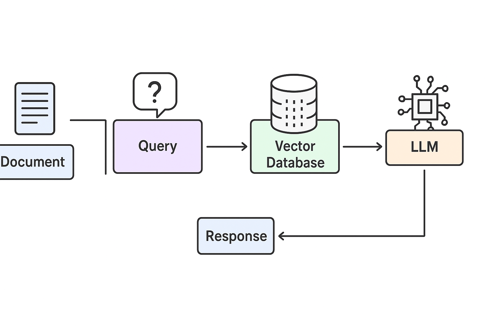

# 
# Build and start all services
docker-compose up -d --build

# Build without detach
docker-compose up --build

# View logs
docker-compose logs -f

docker-compose logs django-web

# Run migrations
docker-compose exec django-web python manage.py migrate

# Create superuser
docker-compose exec django-web python manage.py createsuperuser

# Stop services
docker-compose down

# Stop and remove volumes
docker-compose down -v


# To create a new app
python manage.py startapp core apps/core   
in apps include apps.core


## ContextIQ API

### Base URL

```
/api/v1/contextiq/
```

### Endpoints

#### 1. **Documents**

`GET /documents/` – List all documents  
`POST /documents/` – Upload a new document or add content manually  
`GET /documents/{id}/` – Retrieve a single document  
`PUT /documents/{id}/` – Update a document  
`DELETE /documents/{id}/` – Delete a document

**Example Request:**

```json
POST /api/v1/contextiq/documents/
{
    "title": "Sample Doc",
    "file": "<file upload>",  // optional
    "parse_content": "Manual text content"  // optional
}
```
#### 2. **Semantic Search from all docs**

```json
GET /api/v1/contextiq/documents/?q=............  
```

#### 3. **Query / Semantic Search on a single docs**


```json
POST /api/v1/contextiq/query/

{
    "document_id": "123e4567-e89b-12d3-a456-426614174000",
    "query": "What is the main topic of this document?"
}
```

**Response:**

```json
{
    "results": [
        {
            "content": "Text chunk from document matching the query",
            "metadata": {
                "document_id": "123e4567-e89b-12d3-a456-426614174000",
                "title": "Sample Doc"
            }
        }
    ]
}
```

**Notes:**

* Semantic search uses vector embeddings (HuggingFace / OpenAI) for RAG-style retrieval.
* Only relevant chunks of the document are returned.

---


